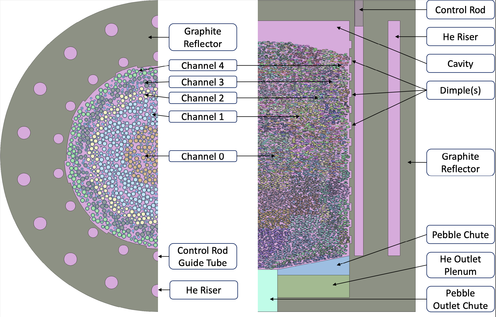

# Summary

Recent interest in nuclear energy has encouraged the development of new reactor designs that make use of passive safety features which operate independent of human input. One such reactor design is the high-temperature gas cooled pebble-bed reactor (PBR) which uses graphite pebbles several centimeters in radius containing on the order of a few grams of nuclear fuel each. These pebbles are contained in a large graphite structure referred to as the reflector and are cooled with helium gas. The low power density and large graphite mass contained in these reactors better enables passive heat removal in the event of an accident scenario. Additionally, the fuel form and pebbles are very effective at containing radioactive fission products produced by the fuel even at high temperatures. Despite the inherent safety of these reactors, it is still important to fully understand operating conditions and shutdown margins of active safety features, such as control rods. This requires extensive modeling from start-up to end-of-life which can be difficult due to the complicated geometry and physics of these reactors. Modeling the early life of these reactors, referred to as the run-in phase, is particularly difficult due to the time dependence of factors such as pebble position, reactor power, and fuel distribution. `kugelpy` generates high-fidelity Monte Carlo neutronics models in Serpent [@LEPPANEN2015142] that utilize radial and axial meshing of the core region and fuel composition tracking to model the run-in phase and operation of PBRs. The Serpent input scripts and post-processing are handled by several Python modules which are broken up into general Serpent reactor functions (`sea_serpent`), PBR and pebble flow functions (`kugelpy`), and basic utilities (`first_mate`). 

# Statement of need

`Kugelpy` is a Python module that is capable of producing Serpent input files for high-temperature gas cooled PBRs, similar to the AVR, HTR-10, or Xe-100 [@osti22039673; @WU200225; @MULDER2020110415]. These reactors generally feature a central pebble bed region feeding into a lower conus or hopper where pebbles are removed from the core. The pebble bed is surrounded by a large graphite reflector containing helium riser channels and control rods. Dimples or divots can be added to the radial reflector's inner wall, which are used to improve pebble flow but have little neutronic significance. The exact dimensions of these features can be edited by the user when instantiating a `PebbleSorter` or `PebbleBedReactor` object. A critical reactor configuration can be determined directly using `perform_criticality_search` function; the `perform_jump_in` method and the `perform_run_in` method allows the user to model the run-in of the reactor from start-up to equilibrium. During a run-in model, the user may directly change the temperature profile, rate of change in power, graphite pebble fraction, fuel composition, and more after each time step. Throughout the simulation(s) pebbles are removed from the bottom of the core, shifted down the core, and added to the top of the core. This gives the user very fine control over the model and provides a means for coupling to other codes to obtain temperature feedback or other parameters of interest. Several papers have been published using `kugelpy`'s parent module, Python Reactor Analysis Toolkit for Engineering Simulations (PyRATES), from which this module was taken [@osti2282751; @PBRTH].

# Example

Included in kugelpy is an annotated Python script [run_in.md](https://github.com/idaholab/kugelpy) which will perform a run-in of a PBR model from start-up to equilibrium. The dimensions and operating conditions for this reactor borrow from a variety of PBR designs to produce the generic pebble-bed reactor (GPBR200) model [@osti2282751]. The GPBR200 serves as the default model for `kugelpy`, but the user can change a variety of variables to produce a unique reactor. A list of these variables can be found in [user_variables.md](https://github.com/idaholab/kugelpy) for reference. The annotated script also shows `Kugelpy`'s `step` functionality, whereby the user can specify a variety of parameters after each time step.

A Serpent geometry rendering of the GPBR200 is shown in the following image [@PBRTH]. From this image the axial and radial meshes that separate the pebbles can be easily visualized, as well as features mentioned previously. It should be noted that only a single pebble geometry input file is provided in `kugelpy`, therefore new pebble geometry input files must be supplied by the user for varying core shapes and sizes. It is important to follow the input file formatting seen in [raw_dist.inp](https://github.com/idaholab/kugelpy/kugelpy/kugelpy/data/raw_dist.inp), but the pebble distribution can be produced by a variety of means including regular lattices, DEM simulations, or random distributions.

{height="150pt"}

# Acknowledgements

Kugelpy is a submodule pulled from Python Reactor Analysis Toolkit for Engineering Simulations (PyRATES), a module developed at the Idaho National Laboratory to help develop reactor analysis models.

This research made use of Idaho National Laboratory’s High Performance Computing systems located at the Collaborative Computing Center and supported by the Office of Nuclear Energy of the U.S. Department of Energy and the Nuclear Science User Facilities under Contract No. DE-AC07-05ID14517.

# References